# Final Assignments 
## Final Assignment 1: AA Meetings Map
Weekly Assignments that contributed to this project: [Weekly Assignment 1](https://github.com/isabelstoddart/data-structures/tree/master/wa01), [Weekly Assignment 2](https://github.com/isabelstoddart/data-structures/tree/master/wa02), [Weekly Assignment 3](https://github.com/isabelstoddart/data-structures/tree/master/wa03), [Weekly Assignment 4](https://github.com/isabelstoddart/data-structures/tree/master/wa04), [Weekly Assignment 6](https://github.com/isabelstoddart/data-structures/tree/master/wa06), [Weekly Assignment 7](https://github.com/isabelstoddart/data-structures/tree/master/wa07), [Weekly Assignment 10](https://github.com/isabelstoddart/data-structures/tree/master/wa10)

The AA Meetings project involved parsing web pages with AA Meetings data and then storing the data in a PostgreSQL database. Then the meetings were displayed on a map of Manhattan, New York using Mapbox.

### Mockup
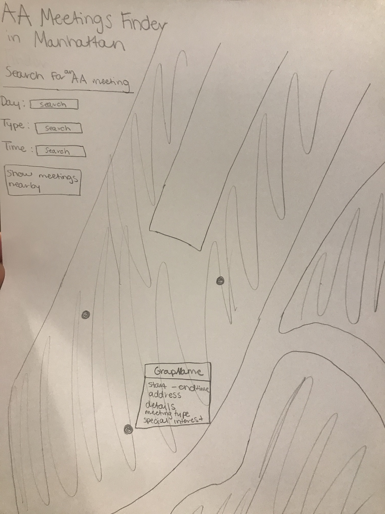

### Current State

The AA map currently defaults to meetings on Fridays after 5 PM.

### AA Meetings Data

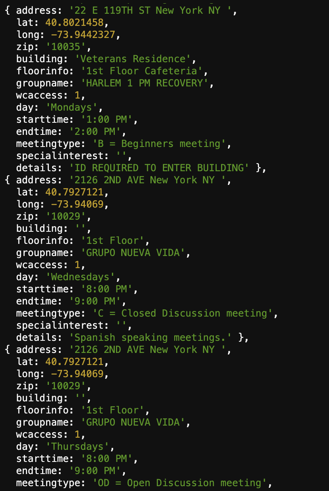

## Final Assignment 2: Progress Blog
Weekly Assignments that contributed to this project: [Weekly Assignment 5](https://github.com/isabelstoddart/data-structures/tree/master/wa05), [Weekly Assignment 6](https://github.com/isabelstoddart/data-structures/tree/master/wa05), [Weekly Assignment 10](https://github.com/isabelstoddart/data-structures/tree/master/wa10)

The Process Blog project involved tracking daily data and recording it in a NoSQL database, MongoDB. I decided to track data involving my studies as a grad student, including how stressed I was, my assignments, if I completed my assignments or not, if I was happy that day, how much sleep I got, how much coffee I had, and if I worked out or not. The different daily entrees are sorted by how stressed I was that day.

### Mockup
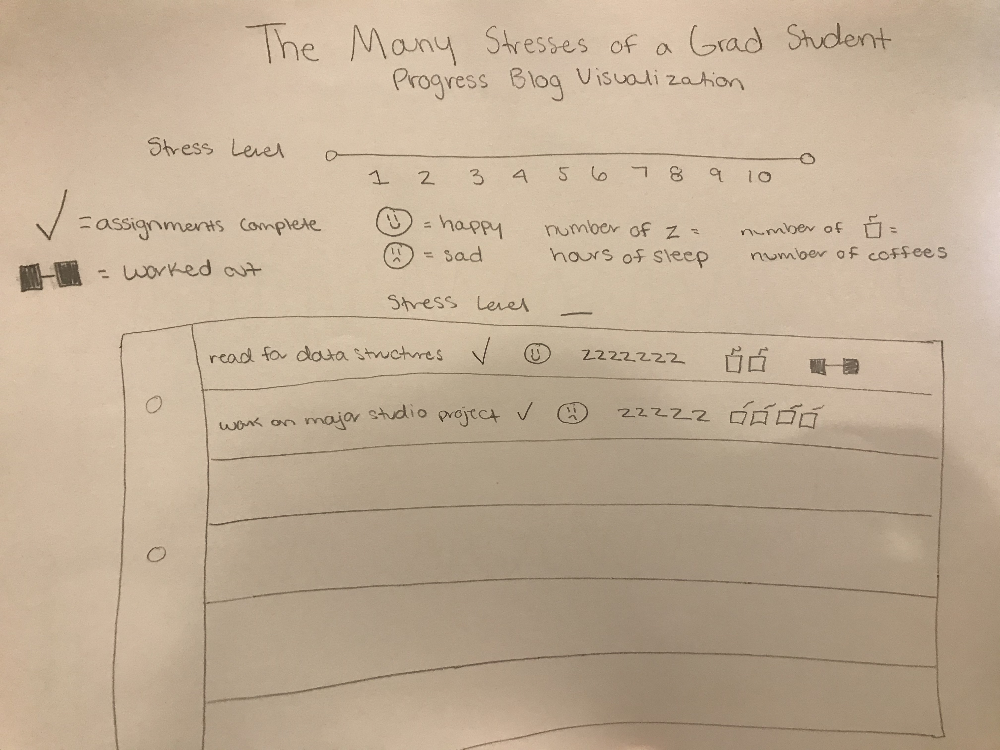

### Screenshots of Current State at Different Stress Levels
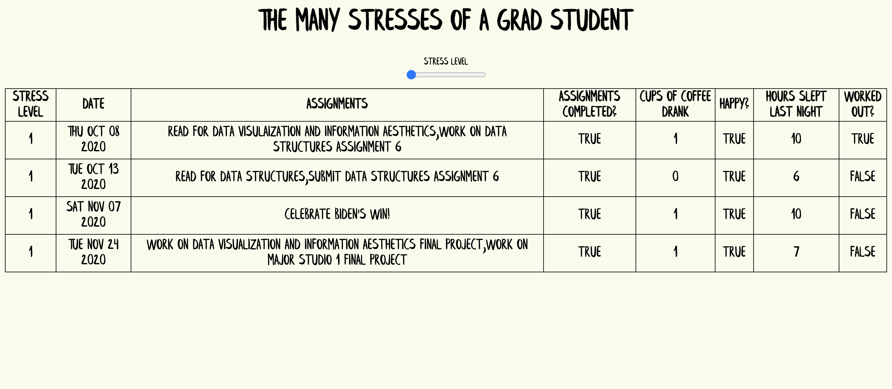
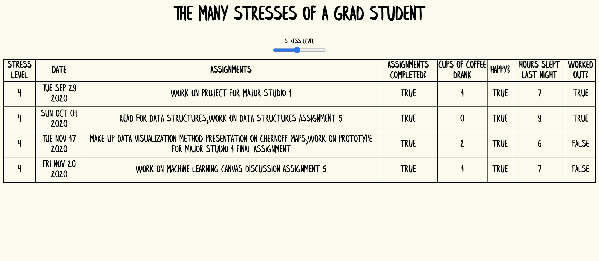
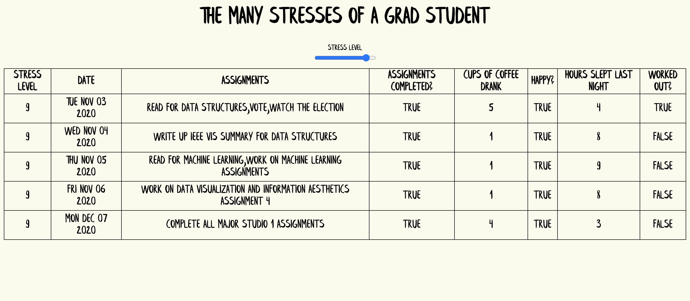

### Process Blog Data
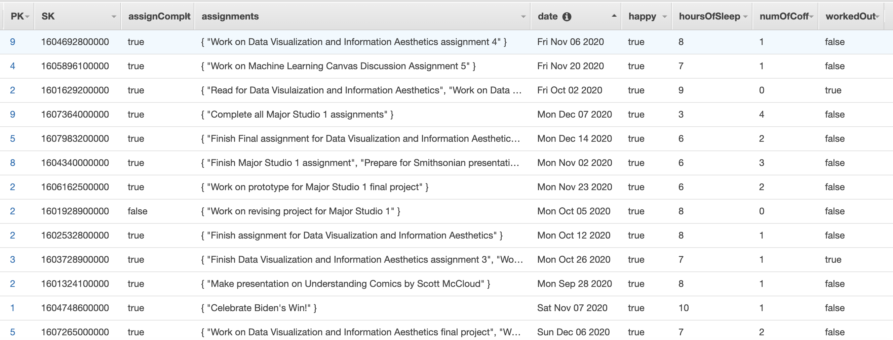

## Final Assignment 3: Temperature Sensor
Weekly Assignments that contributed to this project: [Weekly Assignment 9](https://github.com/isabelstoddart/data-structures/tree/master/wa09), [Weekly Assignment 10](https://github.com/isabelstoddart/data-structures/tree/master/wa10)

The Humidity Tracker project involved tracking the humidity in my bathroom shared by me and my brother to detect how much the humidity changes throughout the day. The humidity data was collected using a photon temperature and humidity tracker. It was then transferred to a PostgreSQL database. The final visualization is a line graph showing the average, maximum, and minimum temperature in the bathroom throughout the day with significant peaks indicating when someone was in the shower. 

### Mockup
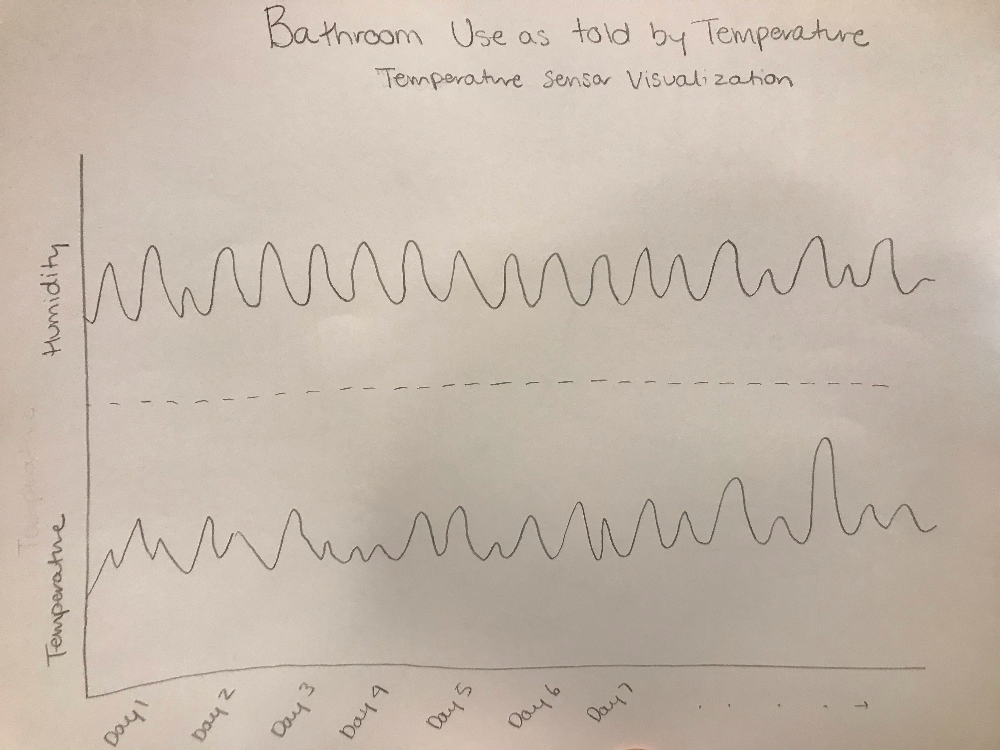

### Temperature/Humidity Tracker

### Current State
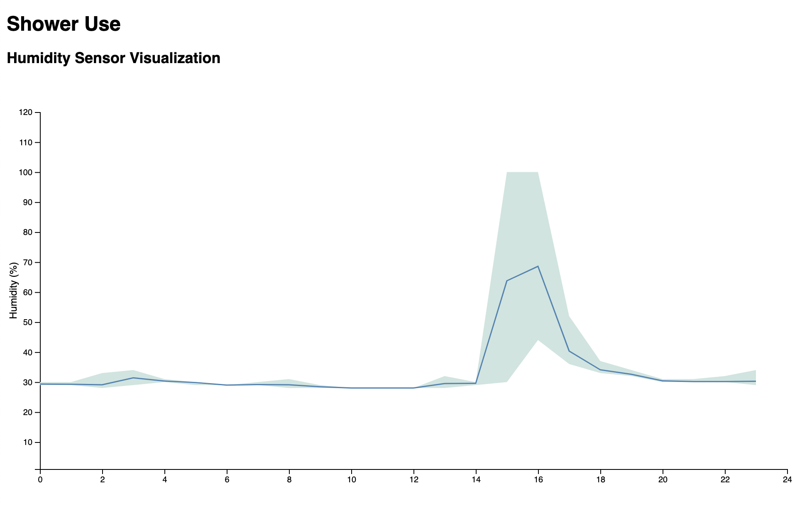

The current state of my humidity sensor visualization shows a line graph with the humidity of the past 24 hours split up and aggregated by hour. The line in the middle of the line graph is the average humidity per hour and the top of the range of the line is the max with the bottom of the range being the minimum. I decided to use this format to show the max, average, and minimum temperature so it was clear how high the humidity goes when someone is in the shower, which I didn't think was obvious with just the average. 

### Query used for Final Visualization
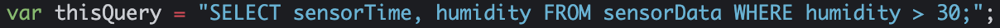

### Temperature/Humidity Sensor Data
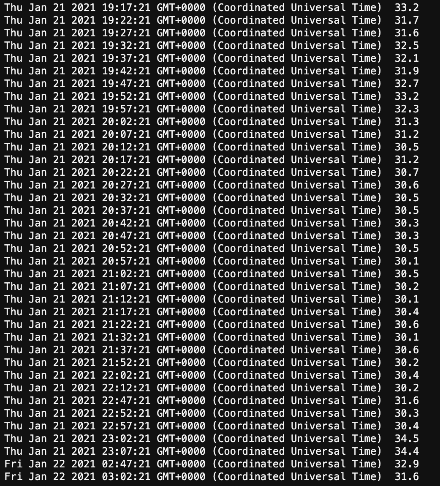
