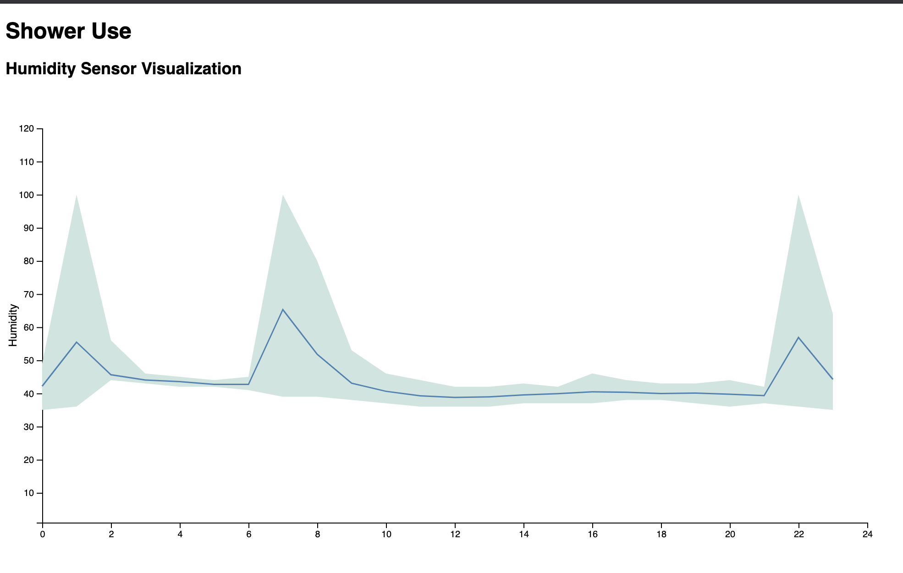

# Final Assignments 
## Final Assignment 1: AA Meetings Map
Weekly Assignments that contributed to this project: [Weekly Assignment 1](https://github.com/isabelstoddart/data-structures/tree/master/wa01), [Weekly Assignment 2](https://github.com/isabelstoddart/data-structures/tree/master/wa02), [Weekly Assignment 3](https://github.com/isabelstoddart/data-structures/tree/master/wa03), [Weekly Assignment 4](https://github.com/isabelstoddart/data-structures/tree/master/wa04), [Weekly Assignment 6](https://github.com/isabelstoddart/data-structures/tree/master/wa06), [Weekly Assignment 7](https://github.com/isabelstoddart/data-structures/tree/master/wa07), [Weekly Assignment 10](https://github.com/isabelstoddart/data-structures/tree/master/wa10)
### Mockup

### Current State

The AA map currently defaults to meetings on Fridays after 5 PM. The tooltip popup includes the name of the group, the address, the start time, the end time, and the day.

### Next Steps
* Format the popup. The tooltip currently includes everything I want it to, but I want it to look nicer
* Make the default the actual day and time of when the user opens the visualization
* Allow user input to change the day, time, and type of meeting they are looking for
* Possibly change the design for the map and location pointers

## Final Assignment 2: Progress Blog
Weekly Assignments that contributed to this project: [Weekly Assignment 5](https://github.com/isabelstoddart/data-structures/tree/master/wa05), [Weekly Assignment 6](https://github.com/isabelstoddart/data-structures/tree/master/wa05), [Weekly Assignment 10](https://github.com/isabelstoddart/data-structures/tree/master/wa10)
### Mockup

### Current State

My progress blog currently involves a table that can be sorted by stress level using the url. 

### Next Steps:
* Make the scroll work so the user can pick the stress level
* Add emoticons to the visualization like in the mockup

## Final Assignment 3: Temperature Sensor
Weekly Assignments that contributed to this project: [Weekly Assignment 9](https://github.com/isabelstoddart/data-structures/tree/master/wa09), [Weekly Assignment 10](https://github.com/isabelstoddart/data-structures/tree/master/wa10)
### Mockup

### Current State

The current state of my humidity sensor visualization shows a line graph with the humidity of the past 48 hours split up and aggregated by hour. The line in the middle of the line graph is the average humidity per hour and the top of the range of the line is the max with the bottom of the range being the minimum. I decided to use this format to show the max, average, and minimum temperature so it was clear how high the humidity goes when someone is in the shower, which I didn't think was obvious with just the average. 

### Next Steps
* Clean up the design, add a title to the visualization and a description
* Add more descriptive labels to the axes of the graph
* Possibly add a tooltip to the graph so the user can follow the exact humidity as they go through the line graph
