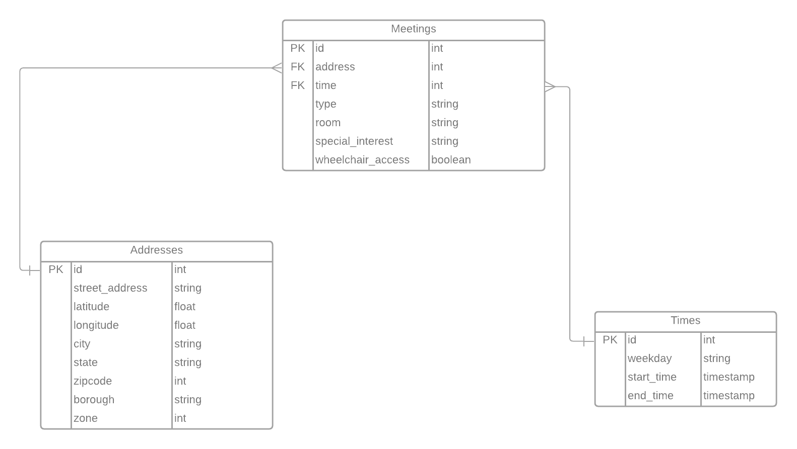

# Weekly Assignment 4
### For data structures at Parsons School of Design

## Part One
Part one of this assignment was to make a data model of the AA Meetings data.I decided to make a normalized data model because I noticed that some of the building addresses are the same for multiple meetings, so I thought having a normalized data model (with multiple tables) would make distinguishing between the different meetings with the same address easier. 

I made an ERD (Entity Relationship Diagram) using Lucidchart shown below:

The datasets included are:
Addresses (Address Id PK, Address Street Info, Latitude, Longitude, City, State, Zipcode, Borough, Zone),
Meetings (Meeting ID PK, Meeting Type, Meeting Address FK, Meeting Room, Meeting Time FK, Special Interest, Wheelchair Access),
Times (Time ID PK, Day of Week, Start Time, End Time)

I made Addresses and Times into separate datasets from the main data set (Meetings) because there can be multiple meetings with the same address and time and it would be redundant to repeat these in the main dataset.

## Part Two
Part two of this assignment was to create a database for AA Meetings and then to create a table. I started with the starter code shown below:

    const { Client } = require('pg');
      const dotenv = require('dotenv');
    dotenv.config();  

    // AWS RDS POSTGRESQL INSTANCE
    var db_credentials = new Object();
    db_credentials.user = 'aaron';
    db_credentials.host = 'dsdemo.c2g7qw1juwkg.us-east-1.rds.amazonaws.com';
    db_credentials.database = 'mydb';
    db_credentials.password = process.env.AWSRDS_PW;
    db_credentials.port = 5432;

    // Connect to the AWS RDS Postgres database
    const client = new Client(db_credentials);
    client.connect();

    // Sample SQL statement to create a table: 
    var thisQuery = "CREATE TABLE aalocations (address varchar(100), lat double precision, long double precision);";
    // Sample SQL statement to delete a table: 
    // var thisQuery = "DROP TABLE aalocations;"; 

    client.query(thisQuery, (err, res) => {
        console.log(err, res);
        client.end();
    });
    
 The only thing I changed in the starter code was the information for the RDS PostgreSQL instance to match my information.
 
 ## Part Three
 Part three of this assignment was to populate the database. I started with the starter code shown below:
 
    const { Client } = require('pg');
    var async = require('async');  
    const dotenv = require('dotenv');
    dotenv.config();  

    // AWS RDS POSTGRESQL INSTANCE
    var db_credentials = new Object();
    db_credentials.user = 'aaron';
    db_credentials.host = 'dsdemo.c2g7qw1juwkg.us-east-1.rds.amazonaws.com';
    db_credentials.database = 'mydb';
    db_credentials.password = process.env.AWSRDS_PW;
    db_credentials.port = 5432;

    var addressesForDb = [ { address: '63 Fifth Ave, New York, NY', latLong: { lat: 40.7353041, lng: -73.99413539999999 } }, { address: '16 E 16th St, New York,            NY', latLong: { lat: 40.736765, lng: -73.9919024 } }, { address: '2 W 13th St, New York, NY', latLong: { lat: 40.7353297, lng: -73.99447889999999 } } ];

    async.eachSeries(addressesForDb, function(value, callback) {
        const client = new Client(db_credentials);
        client.connect();
        var thisQuery = "INSERT INTO aalocations VALUES (E'" + value.address + "', " + value.latLong.lat + ", " + value.latLong.lng + ");";
        client.query(thisQuery, (err, res) => {
            console.log(err, res);
            client.end();
        });
        setTimeout(callback, 1000); 
    }); 
    
For this one, I changed the RDS PostgreSQL information to match mine and read in my addresses JSON file to add to the database. 

## Part Four
Part four of this assignment was to check to make sure all of the addresses were added to the database. I started with the starter code below:

    const { Client } = require('pg');  
    const dotenv = require('dotenv');
    dotenv.config();  

    // AWS RDS POSTGRESQL INSTANCE
    var db_credentials = new Object();
    db_credentials.user = 'aaron';
    db_credentials.host = 'dsdemo.c2g7qw1juwkg.us-east-1.rds.amazonaws.com';
    db_credentials.database = 'mydb';
    db_credentials.password = process.env.AWSRDS_PW;
    db_credentials.port = 5432;

    // Connect to the AWS RDS Postgres database
    const client = new Client(db_credentials);
    client.connect();

    // Sample SQL statement to query the entire contents of a table: 
    var thisQuery = "SELECT * FROM aalocations;";

    client.query(thisQuery, (err, res) => {
      console.log(err, res.rows);
      client.end();
     });
     
 For this one, I changed the RDS PostgreSQL information to match mine and then added a query to get the count of all of the locations to confirm that I added the correct amount to the database. I found that 53 locations were added, so all of the code worked correctly.
