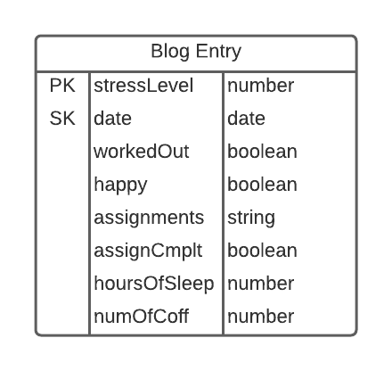

# Weekly Assignment 5
### For data structures at Parsons School of Design

## Part One
Part one of this assignment was to make a data model of the Process Blog data. I decided to make a school journal for my process blog. 

The variables included in each blog entry object are shown below:

The vaiables included are:

stressLevel(number), date(date), workedOut(boolean), happy(boolean), assignments(string), assignCmplt(boolean), hoursOfSleep(number), numOfCoff(number)

I made stress level the partition key so that I can find entries by how stressed I was that day. I made the sorting key the date time. 

## Part Two
Part two of the assignment was to create "Items" for DynamoDB and to store them in an array named blogEntries. I started with the starter code shown below:

    var blogEntries = [];

    class BlogEntry {
    constructor(primaryKey, date, entry, happy, iate) {
        this.pk = {};
        this.pk.N = primaryKey.toString();
        this.date = {}; 
        this.date.S = new Date(date).toDateString();
        this.entry = {};
        this.entry.S = entry;
        this.happy = {};
        this.happy.BOOL = happy; 
        if (iate != null) {
        this.iate = {};
        this.iate.SS = iate; 
        }
        this.month = {};
        this.month.N = new Date(date).getMonth().toString();
        }
    }

    blogEntries.push(new BlogEntry(0, 'August 28 2019', "Yay, first day of class!", true, ["Cheez-Its", "M&Ms"]));
    blogEntries.push(new BlogEntry(1, 'October 31, 2015', "I piloted my first solo flight!", true, ["pancakes"]));
    blogEntries.push(new BlogEntry(2, 8675309, "867-5309?", false));
    blogEntries.push(new BlogEntry(3, 'September 25, 2019', "I taught my favorite students.", true, ["peas", "carrots"]));

    console.log(blogEntries);
 
 I changed the starter code to include my variables for the BlogEntry object.
 
 ## Part Three
 Part three of this assignment was to populate the database. I started with the starter code shown below:
 
    var AWS = require('aws-sdk');
    AWS.config = new AWS.Config();
    AWS.config.region = "us-east-1";

    var dynamodb = new AWS.DynamoDB();

    var params = {};
    params.Item = blogEntries[0]; 
    params.TableName = "processblog";

    dynamodb.putItem(params, function (err, data) {
        if (err) console.log(err, err.stack); // an error occurred
        else     console.log(data);           // successful response
    });
   
I added a loop to add all of my blog entries, instead of just the one, and made sure not to attempt more than 2 puts per second.

Finally, I checked my items on DynamoDB and all four were there.
