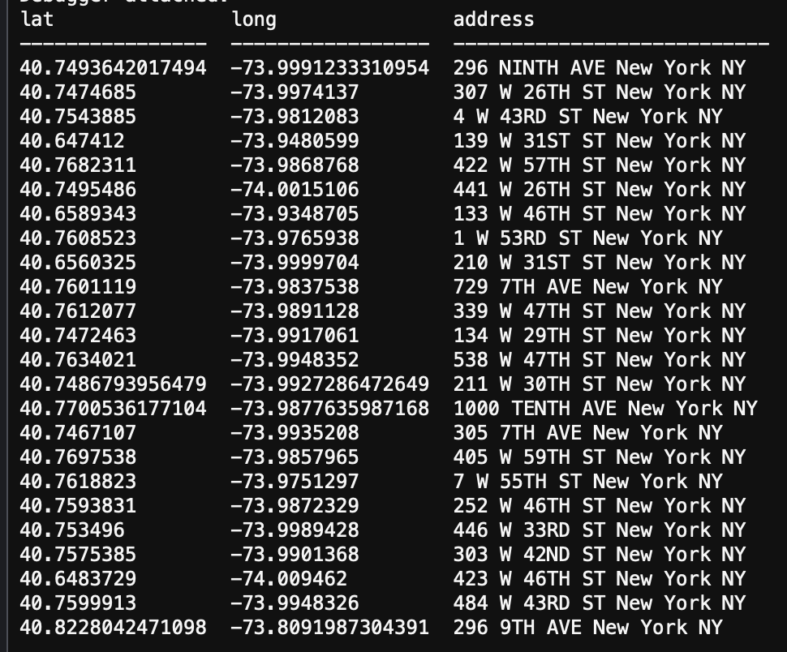
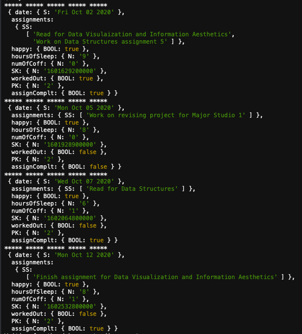

# Weekly Assignment 6
### For data structures at Parsons School of Design

## Part One
Part one of this assignment was to write and execute a query for the AA data. I started with the starter code shown below:

    const { Client } = require('pg');
    const cTable = require('console.table');

    // AWS RDS POSTGRESQL INSTANCE
    var db_credentials = new Object();
    db_credentials.user = 'aaron';
    db_credentials.host = 'aa2020.c2g7qw1juwkg.us-east-1.rds.amazonaws.com';
    db_credentials.database = 'aa';
    db_credentials.password = process.env.AWSRDS_PW;
    db_credentials.port = 5432;

    // Connect to the AWS RDS Postgres database
    const client = new Client(db_credentials);
    client.connect();

    // Sample SQL statement to query meetings on Monday that start on or after 7:00pm: 
    var thisQuery = "SELECT mtgday, mtgtime, mtglocation, mtgaddress, mtgtypes FROM aadata WHERE mtgday = 'Monday' and mtghour >= 19;";

    client.query(thisQuery, (err, res) => {
        if (err) {throw err}
        else {
            console.table(res.rows);
            client.end();
        }
    });
    
After looking at the starter code and how a query for SQL is constructed, I started to think about what I wanted my query to do. Going off of my plan for the AA data I decided I wanted to query all of the unique addresses in the data. I did this because for my AA data plan I want to have a seperate table with just the unique addresses that can map back to the meeting data.
To do this I wrote the query below:

    var thisQuery = "SELECT lat,long,address FROM aalocations GROUP BY lat,long,address;";
    
**Edit** This query gets the same result in a slightly more efficient way. It shows that there are multiple ways to get the same result.

    var thisQuery = "SELECT DISTINCT lat, long, address FROM aalocations;";
           
In this query I selected the latitude, longitude, and address from the aa locations data and grouped them by latitude, longitude, and addresses. This got only the unique sets of latitude, longtitude, and address. For my query I did not include a WHERE clause because I wanted all of the address data. I did not want to hone in on just one type of address so a WHERE clause was not necessary.

The results of the query are below:

## Part Two
Part two of the assignment was to write and execute a query for the progress blog data. I started with the starter code shown below:

    // npm install aws-sdk
    var AWS = require('aws-sdk');
    AWS.config = new AWS.Config();
    AWS.config.region = "us-east-1";

    var dynamodb = new AWS.DynamoDB();

    var params = {
        TableName : "aaronprocessblog",
        KeyConditionExpression: "#tp = :topicName and dt between :minDate and :maxDate", // the query expression
        ExpressionAttributeNames: { // name substitution, used for reserved words in DynamoDB
            "#tp" : "topic"
        },
        ExpressionAttributeValues: { // the query values
            ":topicName": {S: "work"},
            ":minDate": {N: new Date("August 28, 2020").valueOf().toString()},
            ":maxDate": {N: new Date("December 11, 2020").valueOf().toString()}
        }
    };

    dynamodb.query(params, function(err, data) {
        if (err) {
            console.error("Unable to query. Error:", JSON.stringify(err, null, 2));
        } else {
            console.log("Query succeeded.");
            data.Items.forEach(function(item) {
                console.log("***** ***** ***** ***** ***** \n", item);
            });
        }
    });
 
After looking at the starter code and how a query for NoSQL is constructed, I started to think about how I wanted to query my progress blog data. I picked stress level as my primary key because I wanted to get the data out of the table by how stressed I was on that day. For my query, I decided to look at days where I was at a stress level of 2. My sort key is the date and time. I sorted by including all dates through September to November because I didn't want to hone in on any dates at the moment. I think looking at stress level will be really helpful as I make more queries because I can look at each stress level group and see if there is any correlation between hours slept, assigments due, amount of coffee drank, etc.

My query is below:

    var params = {
        TableName : "processblog",
        KeyConditionExpression: "#stresslevel = :stress and #dt between :minTime and :maxTime", // the query expression
        ExpressionAttributeNames: { // name substitution, used for reserved words in DynamoDB
            "#stresslevel" : "PK",
            "#dt" : "SK"
        },
        ExpressionAttributeValues: { // the query values
            ":stress": {N: "2"},
            ":minTime" : {N: new Date('September 1, 2020 1:00:00').getTime().toString()},
            ":maxTime" : {N: new Date('November 30, 2020 23:00:00').getTime().toString()}
        }
    };
    
The results of this query are below:

