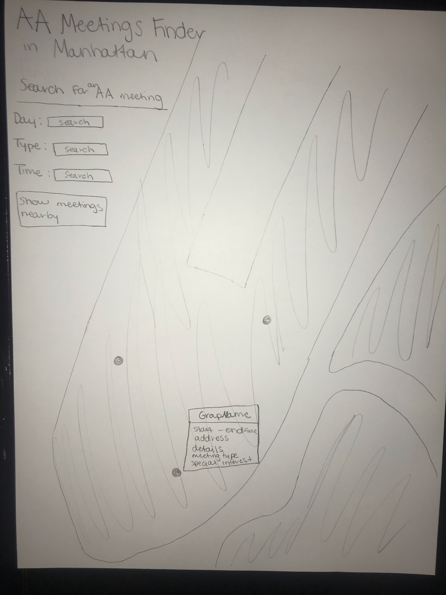
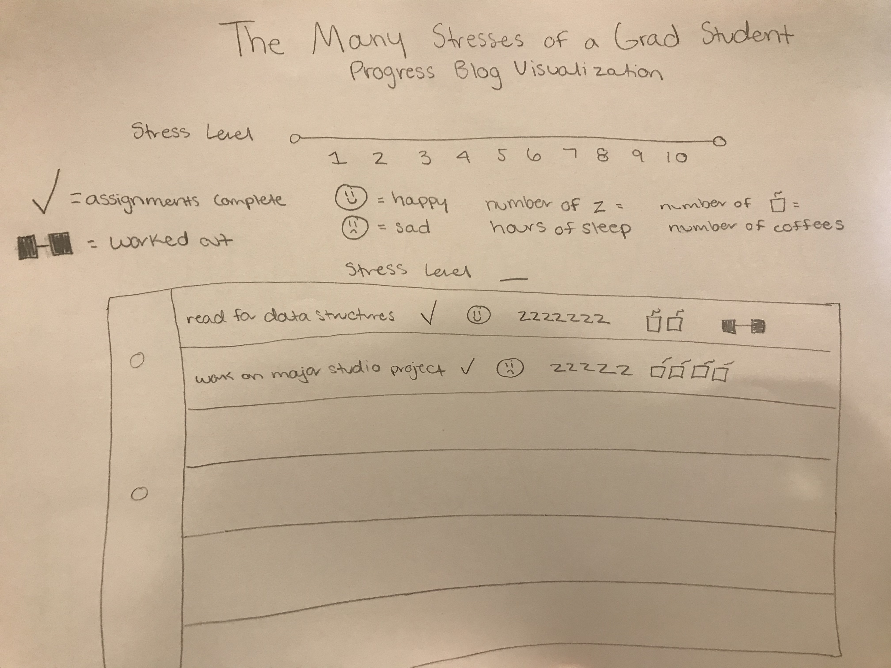
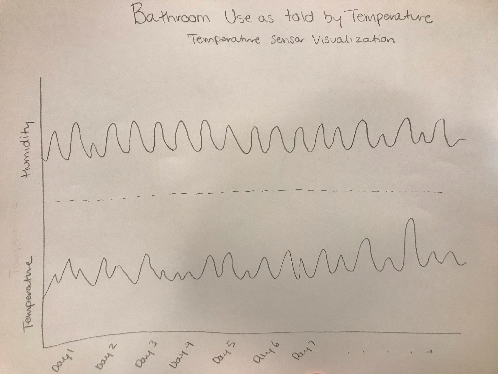

# Weekly Assignment 10
### For data structures at Parsons School of Design

The purpose of this assignment is to design interfaces for the three data sources we are using (AA, process blog, and sensors). I have included my interface designs below.

## AA Meetings

My visualization for the AA Meetings data will look like a map of manhattan using the design of apple maps and google maps (green for land, blue for water, white for streets). I want to use this design because these are the maps users typically use to get around and I want my map to be intuitive to the user. There will be dots on the map for each AA Meetings and when the user clicks on each dot a pop up box will appear with the group name, start time and end time of the meeting, address of the meeting, and the details, meeting type, and special interest of the meeting. There will be a search bar at the top where the user can select a day, a time, and/or a type of meeting which will result in only dots fitting those criteria showing up on the map. There will also be a "Show meetings nearby" button that shows the meetings near the users location at the time the user clicks the button, incase a user needs to go to a meeting right away. 

The lat and long will need to be mapped to each dot on the map. The day, type, and time will be mapped to the search bar and used to sort each meeting. The group name, start and end time, address, details, meeting type, and special interest will also need to be mapped to each dot. The data won't need any restructuring or aggregation to get it into this visualization. It is already set up so that it can be mapped onto the visualization. It will just need to be pulled out of the json. The data mapped to the dots will need to be filtered by day, type, and time according to what the user picks for their search query.

The default view will be the map of manhattan with all of the meetings showing. I am assuming that the user can read and know how to work a basic map and understand that dots on a map indicate a location. I am also assuming that the user knows how to use a search bar and that they know the basic layout of Manhattan and can find the address of each meeting. 

## Process Blog

My visualization for the process blog data will resemble a diary. I want this visualization to be fun and diary like. I will have a background that looks like a piece of diary paper with each line of the paper having a different diary entry. Each diary entry will include my assignments for that day, a check if I completed them, a smiley face if I was happy that day, a sad face if I was not happy that day, a z for each hour of sleep I got that day, a cup of coffee symbol for each cup of coffee I had that day, and a dumbbell if I worked out that day. The user will be able to sort each the entries by stress level and the entries will be listed in order of date.

Assigncomplt, assignments, happy, hoursOfSleep, numOfCoff, and workedOut will be mapped to each line on the paper. stressLevel will be mapped to the slide bar and used to sort each entree and date will be used to sort each entry. The data will not need aggregated or restructered in any way. The data will need to be filtered by stress level and sorted by date.

The default view will be all of the entries on the page in order of date. I am assuming that the user knows how to use a slide bar and understands the concept of writing on paper. 

## Sensors

My visualization for for the sensors data will have two line graphs on top of eachother, one for temperature and one for humidity. The x axis will have each day with space in between each day to show the difference in temperature within just that day. The y axis will have a counter for temperature for the temperature graph and a counter for humidity for the humidity graph. I will make each graph a different color and have the color of the graph change for high vs low temperature/humidity. I will probably use green to blue for humidity and purple to red for temperature. I chose a line graph for this visualization because I want to show a continuous change over time and line graphs are a good way to show this.

Temperature will need to be mapped to the temperature line graph and humidity will need to be mapped to the humidity line graph. The data may need to be aggregated, possibly by hours, so the line graph doesn't have to be split up into 5 minute intervals. 

The default view will be the line graphs on top of each other. This view will not change with user interaction. I am assuming that the user understand how to read a line graph.
